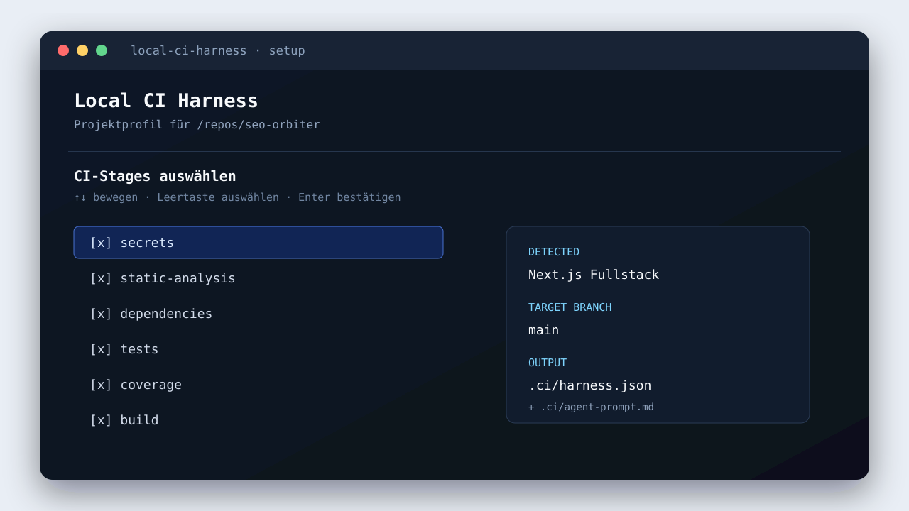

# Local CI Harness · lokale CI für beliebige Git-Repositories

Ein Docker-basierter, lokal aufrufbarer Quality-/Security-Harness für lokale
Agenten- und Entwicklungsworkflows. Zwei getrennte Pipelines, nachvollziehbare
Exit-Codes, Quellcode-Snapshots
und maschinenlesbare Ergebnisse. Kein Jenkins, kein Cloud-Account für die Scans,
kein Docker-Socket in den Job-Containern.

**Lieferstatus:** implementiertes Starterprojekt, 89 automatisierte Harness-Tests.
Ein realer macOS-/Colima-Lauf wurde durchgeführt. Die App-Stages waren erfolgreich;
der Sonar-JavaScript-Scan benötigte in einer Colima-VM mit 4 GB RAM mehr Ressourcen.
Linux und Windows/WSL2 sind als Zielplattformen vorgesehen, wurden in diesem Checkout
aber nicht vollständig Ende-zu-Ende ausgeführt. `docs/VALIDATION.md` trennt geprüfte
und noch zu prüfende Eigenschaften.
**Kein „OWASP Top 10 bestanden“-Siegel, kein Pentest, keine Sicherheitsgarantie.**

Copyright 2026 codepawfect. Licensed under the [Apache License 2.0](LICENSE).

> **Setup once. Gate locally. Ship with evidence.**
>
> A local-first CI harness for existing Git repositories. It snapshots the exact
> working tree, runs security, quality, test and build checks in ephemeral containers,
> and gives an agent a structured decision before a merge or push.

<p align="center">
  <a href="LICENSE"></a>
  
  
  
</p>

| Local-first | Evidence-first | Agent-ready | Secure defaults |
|---|---|---|---|
| No GitHub or Jenkins required | JSON + Markdown reports per run | Generated `.ci/agent-prompt.md` | Central policies and image digests stay protected |

<p align="center">
  
</p>
<p align="center"><em>Interactive setup: detect the repository, choose an adapter, select stages, confirm.</em></p>

### Inhaltsverzeichnis

- [Schnellstart](#schnellstart)
- [Adapter und Frameworks](#adapter-und-frameworks)
- [Monorepos](#monorepos)
- [Agentenprompt](#agentenprompt)
- [Plattformen und Ressourcen](#unterstützte-plattformen)
- [Details und Grenzen](#1-was-du-bekommst)

## Schnellstart

Der Harness läuft lokal und benötigt weder GitHub noch Jenkins. Du installierst ihn
einmal pro Rechner, richtest ein oder mehrere lokale Git-Repositories ein und startest
ein Gate nur dann, wenn ein Agent oder du einen Merge-/Push-Schritt vorbereitest.

### Unterstützte Plattformen

| Plattform | Voraussetzung | Ausführung |
|---|---|---|
| macOS | Python 3.10+, Git, Docker CLI mit Compose v2, Colima | direkt im Terminal; Colima wird bei Bedarf verwendet |
| Linux | Python 3.10+, Git, Docker Engine mit Compose v2 | direkt im Terminal |
| Windows | WSL2 mit Ubuntu/Linux sowie Docker Desktop mit WSL-Integration oder Docker Engine in WSL2 | alle `ci`-Befehle innerhalb von WSL2, nicht in PowerShell/cmd |

Native Windows-PowerShell wird nicht unterstützt. Für Sonar sollte die Docker-/Colima-
Umgebung ausreichend Arbeitsspeicher erhalten; 4 GB waren für die JavaScript-/TypeScript-
Analyse in der lokalen Abnahme nicht zuverlässig.

### Einmalige Einrichtung

Aus dem öffentlichen Harness-Repository:

```sh
git clone https://github.com/DEINE-ORG/local-ci-harness.git
cd local-ci-harness

./ci init
./ci doctor
./ci lock-images --runtime
```

`DEINE-ORG` ersetzt du durch die tatsächliche Repository-Organisation. `init` legt die
lokale Harness-Konfiguration an. `doctor` prüft Python, Git, Docker/Compose und die
Runtime. `lock-images --runtime` lädt die benötigten Images und schreibt die geprüften
Digests in `images.lock.json`; diese Datei muss versioniert werden. Auf macOS startet
der Harness Colima bei Bedarf automatisch. Unter Windows öffnest du dafür zuerst ein
WSL2-Terminal und führst alle Befehle dort aus.

### Erstes lokales Projekt anbinden

`--repo` zeigt immer auf das bereits lokal ausgecheckte Zielprojekt, nicht auf das
Harness-Repository:

```sh
./ci setup --repo /absolute/path/to/project
./ci prompt --repo /absolute/path/to/project
```

`setup` erkennt Repository, Branch, Framework, Lockfiles, Tests und verfügbare Scripts
und schreibt im Zielprojekt `.ci/harness.json` sowie `.ci/agent-prompt.md`. Fehlende
Voraussetzungen werden im Profil sichtbar gemacht und nicht still übersprungen.

### Gate vor Merge oder Push

```sh
./ci gate \
  --repo /absolute/path/to/project \
  --intent merge-to-main
```

Nach einem lokalen Merge auf `main` verwendest du stattdessen:

```sh
./ci gate \
  --repo /absolute/path/to/project \
  --intent push-main
```

Der Harness führt selbst keinen Merge, Commit oder Push aus. Die Auswertung steht in
`reports/<project-slug>/<run-id>/summary.md` und `summary.json`. Exit-Code `0` bedeutet
`READY`; `REVIEW`, `FAIL` und `BLOCKED` liefern Exit-Code `1`, Infrastruktur- oder
Konfigurationsfehler Exit-Code `2`.

### Wenn das Projekt Sonar aktiviert

Nur wenn `.ci/harness.json` die `sonar`-Stage enthält, einmalig vor dem ersten Gate:

```sh
./ci up
./ci bootstrap --repo /absolute/path/to/project
```

Der Bootstrap richtet Sonar lokal ein, rotiert den initialen `admin`-Login automatisch,
weist Quality Profile und Gate zu und erzeugt ein projektspezifisches Analysis-Token.
Eine Browser-Übernahme oder ein manueller Passwortwechsel ist nicht erforderlich.
Für die Browseransicht legt er zusätzlich einen lokalen Read-only-Account an. Das
Admin-Passwort bleibt intern; die bewusst angeforderten UI-Credentials erhältst du
nach erfolgreichem Bootstrap mit:

```sh
./ci sonar credentials
```

Der Befehl zeigt URL, Benutzername und Read-only-Passwort einmalig im Terminal an.
Das Passwort steht nicht in Reports, Projektprofilen oder Logs. Die Datei
`.local/sonar-reader.password` bleibt lokal und wird mit `0600` geschützt.
Um eine Analyse nach dem Gate in der Sonar-Oberfläche zu öffnen, starte den lokalen
Stack bei Bedarf erneut:

```sh
./ci up
./ci sonar credentials
# http://127.0.0.1:9000 im Browser öffnen
./ci down   # nach der Sichtung; Volumes bleiben erhalten
```

Ohne Sonar-Stage ist dieser Schritt nicht nötig. Nach erfolgreichem Bootstrap startet
`gate` die temporären Sonar-/Postgres-Container für einen Sonar-Lauf selbst und entfernt
sie wieder; `./ci up` bleibt für Bootstrap und UI-Sichtung der bewusste manuelle Modus.

Weitere Adapter, Monorepo-Unterverzeichnisse, Agentenregeln und Sicherheitsgrenzen
stehen in den folgenden Kapiteln. Für einen ersten Lauf reichen die Schritte oben.

## 1. Was du bekommst

| Bereich | Implementierte Schritte |
|---|---|
| Spring Boot | Gitleaks, Semgrep, `mvn -Pci clean verify`, Surefire-/Failsafe-Nachweis, JaCoCo, CycloneDX-SBOM, Trivy-Abhängigkeiten/IaC, SonarQube + Quality Gate |
| Next.js | Gitleaks, Semgrep, `npm ci`, ESLint, Typecheck, Vitest, Coverage, Prettier-Check, Produktionsbuild, Trivy-Abhängigkeiten/IaC, SonarQube + Quality Gate |
| Browser, separat | Versionspassendes Playwright-Image, frische Installation, Produktionsbuild/-server, Browser-Tests, Screenshots/Traces; Vorlage für axe-Accessibility |
| HTTP-Sicherheit, separat | ZAP-Baseline gegen ausdrücklich bestätigtes lokales Testdeployment; passive Prüfung, nicht vollständiger aktiver DAST |
| Codex | CLI, `summary.json`, Markdown, einzelne Logs/Fundstellen, Regeln für Iteration und Freigaben |

Das ist eine **lokale ausführbare Pipeline**, kein Server mit automatisch ausgelösten
Push-/Merge-Events. Ein Agent oder du startet sie über `./ci`. Später kann ein geschützter
CI-Job dieselben Regeln verwenden. Es wird kein fertiges Backend/Frontend generiert:
Die Adapter prüfen deine bestehenden Repositories, die Vorlagen werden dort integriert.

## 2. Voraussetzungen und bewusst begrenzter Scope

Host: macOS, Linux oder WSL2; Python **3.10+**, Git und Docker CLI mit Compose v2.
Auf macOS verwendet der Harness standardmäßig **Colima** als Docker-Runtime und
startet das Profil `default` bei Bedarf mit Docker-Runtime. Docker Desktop wird nur
verwendet, wenn dies im vertrauenswürdigen `harness.json` ausdrücklich als
`container_runtime.provider: "docker"` konfiguriert ist. Native
Windows-PowerShell wird durch den `fcntl`-basierten Runner nicht unterstützt: dort
WSL2 verwenden. Host-Java/Maven/Node sind für die eigentlichen Pipelines nicht
erforderlich. Für das einmalige Bearbeiten/Installieren der
Frontend-Entwicklungsabhängigkeiten ist deine übliche Entwicklungsumgebung hilfreich.

Startadapter: **Java 21, Maven 3.9, einzelnes Maven-Modul** sowie **Next.js 16,
TypeScript, npm-Lockfile v2/v3, `src/`-Layout**. Andere Versionen/Layouts benötigen
bewusste Anpassungen. Die tatsächlichen Spring-/Next-Abhängigkeiten werden NICHT
von diesem Projekt aktualisiert. Native ARM-/x86-Image-Verfügbarkeit beim Locken
prüfen; keine automatische Architektur-Emulation.

Das konfigurierte `path` muss auf einen Git-Repository-Root mit mindestens einem
Commit zeigen. Monorepo: derselbe Repository-Root für beide Projekte, unterschiedliche
`subdir`-Werte. Git-Worktrees werden unterstützt; Submodule und Maven-Reactoren
werden ausdrücklich abgelehnt statt unvollständig geprüft. Gradle, pnpm, Yarn und
npm-Workspaces besitzen noch keinen eigenen Adapter.

## 3. Grundinstallation

Entpacke dieses Projekt idealerweise neben deine App-Repositories:

```text
workspace/
  backend/
  frontend/
  local-ci-harness/
```

```sh
cd local-ci-harness
chmod +x ci
./ci init
```

`init` erstellt `harness.json` und eine lokale `.env` mit zufälligem Sonar-DB-Passwort.
Bestehende Dateien werden nicht überschrieben. Trage danach in `harness.json` deine
Repository-Pfade, Sonar-Projektschlüssel und gegebenenfalls App-Unterverzeichnisse ein.
Für nur ein Projekt den anderen Eintrag unter `projects` vollständig entfernen.
Wenn du ausschließlich den neuen Profil-Workflow verwendest, müssen dort keine
Legacy-Projekte eingetragen sein; die vertrauenswürdige Image-/Sonar-Konfiguration
reicht für `setup`, `bootstrap --repo` und `gate` aus.

Die Beispielkonfiguration wählt die Runtime plattformabhängig. Auf macOS bedeutet
`auto` Colima, auf Linux/WSL2 Docker Engine:

```json
"container_runtime": {
  "provider": "auto",
  "profile": "default",
  "auto_start": true
}
```

Fehlt der Block in einer bestehenden Installation, gilt auf macOS ebenfalls Colima
als Standard. `ci doctor`, `lock-images` und Gates setzen `DOCKER_HOST` auf den
Colima-Socket. Die einzelnen Job-Container bleiben kurzlebig (`docker run --rm`);
die Colima-VM bleibt zwischen Läufen aktiv, bis du sie mit `colima stop` beendest.

Beispiel Monorepo:

```json
{
  "backend": {"path": "../product", "subdir": "apps/backend"},
  "frontend": {"path": "../product", "subdir": "apps/frontend"}
}
```

Das ist ein **Ausschnitt**: übrige Felder aus `harness.example.json` beibehalten.
Pfade sind relativ zum Harness, nicht zum aktuellen Shell-Verzeichnis. Kommas in
Bind-Mount-Pfaden werden abgelehnt. `environment` enthält explizite Testwerte als
Strings, keine Shell-Expansion und keine automatisch übernommenen Host-Secrets.

```sh
./ci doctor
./ci lock-images
./ci up
```

`lock-images` zieht die konfigurierten Quellen und schreibt echte SHA-256-Image-Digests
in `images.lock.json`. **Diesen Lock versionieren.** Alle folgenden Containerstarts
verwenden Digests, nicht `latest`. Es liegen absichtlich keine erfundenen Digests bei.
Die beweglichen Tags in der Beispielkonfiguration sind nur Ausgangspunkte der
expliziten Auflösung. Ein Lock beweist keine Herkunftssignatur und keine CVE-Freiheit.

Öffne lokal `http://127.0.0.1:9000`. Dann:

```sh
./ci bootstrap
```

Der Bootstrap erkennt bei einer frischen lokalen Sonar-Instanz den Default-Login
`admin`/`admin`, rotiert das Passwort automatisch über die Sonar-API und legt das
generierte lokale Admin-Secret ausschließlich im Harness unter
`.local/sonar-admin.password` mit Dateimodus `0600` ab. Bei einer bereits
angepassten Instanz wird dieses Secret, `SONAR_ADMIN_PASSWORD` oder als letzter
Schritt eine verdeckte Eingabe verwendet. Das Secret wird nicht in Reports oder
Projektdateien geschrieben.

Danach richtet der Bootstrap die in `harness.json` eingetragenen Projekte, das
Quality Gate und kopierte Sonar-way-Profile ein. Für spätere Scans werden
projektgebundene Analysis-Tokens und ein separater Reader verwendet. Alle Tokens
liegen ausschließlich unter `.local/` mit Dateimodus `0600`.

Für ein beliebiges lokal ausgechecktes Projekt wird stattdessen das versionierte
Projektprofil verwendet:

```sh
./ci bootstrap --repo ~/repos/mein-saas
```

Der profilbasierte Bootstrap liest `.ci/harness.json`, leitet den Sonar-Schlüssel
aus `sonar_key` beziehungsweise dem Projektslug ab, wählt Java oder JavaScript/
TypeScript anhand des Adapters, weist die lokalen Quality Profiles und das zentrale
Harness-Quality-Gate zu und erzeugt einen eigenen Analysis-Token. Der Eintrag wird
unter `profile_projects` in `.local/sonar-policy.json` dokumentiert. Bestehende
Legacy- oder andere Profilprojekte bleiben im Manifest erhalten.

**Sonar braucht eine Ersteinrichtung und eine Baseline.** `up` wartet auf einen
bereiten Server; `bootstrap` erledigt die initiale Passwortrotation und Provisionierung
ohne Browser-Übernahme. Bei Elasticsearch-/Host-Limit-Fehlern zuerst die Compose-Logs und
die Host-Anforderungen der tatsächlich gepinnten Sonar-Version prüfen. Keine
Bootstrap-Sicherheitschecks deaktivieren. Bei API-/Metrik-Inkompatibilität bricht der
Bootstrap ab; er wechselt nicht still auf ein schwächeres Gate. Siehe technische Doku.

### Container-Lifecycle auf macOS

Ein profilbasierter Gate-Lauf benötigt normalerweise keinen vorher laufenden
Anwendungscontainer. Gitleaks, Semgrep, Trivy, Node, Maven, Python und Playwright
werden als kurzlebige Job-Container mit `--rm` gestartet und nach jeder Stage entfernt.

Nur wenn das Profil die `sonar`-Stage enthält, startet `gate` den Compose-Stack mit
`postgres` und `sonarqube` erst nach erfolgreichen App-Stages (Build/Tests/E2E),
wartet auf SonarQube und führt danach automatisch `docker compose down
--remove-orphans` aus. Die drei Sonar-Volumes bleiben erhalten, Container und deren
Speicherverbrauch nicht. So bleiben Quality-Gate-Baseline, lokale Projekte und
Tokens für den nächsten Lauf verfügbar, ohne Sonar während des speicherintensiven
App-Builds mitlaufen zu lassen.

`./ci up` bleibt als manueller Administrations-/Bootstrap-Befehl bestehen und lässt
den Stack absichtlich laufen, bis `./ci down` ausgeführt wird. Für normale profilierte
Gates ist dieser Schritt nach erfolgreichem Bootstrap nicht erforderlich. ZAP und
projektspezifische Testdatenbanken sind bewusst externe Ausnahmen: ZAP benötigt ein
ausdrücklich bestätigtes lokales Testziel; eine optionale Test-DB muss vor dem Lauf
gestartet und anschließend wieder gestoppt werden.

## 4. Beliebige lokale Projekte anbinden

Für neue SaaS-Repositories gibt es einen lokalen, projektprofilbasierten Workflow.
Er benötigt weder GitHub noch Jenkins. Das Repository bleibt an seinem vorhandenen
lokalen Pfad; nur Snapshot, Laufzeitdaten und Reports werden im Harness isoliert.

```sh
./ci setup --repo ~/repos/mein-saas
./ci prompt --repo ~/repos/mein-saas
# Monorepo: commands/evidence are relative to this application directory
./ci setup --repo ~/repos/product --subdir apps/web
```

`setup` erkennt Git-Root, Zielbranch, Lockfiles, Next.js, Spring/Maven, Playwright
und vorhandene Scripts. Interaktiv wählst du Adapter und Stages in einer Python-
Standardbibliothek-TUI. Die Konfiguration wird versionierbar in
`~/repos/mein-saas/.ci/harness.json` gespeichert; der zugehörige Agentenprompt liegt
unter `.ci/agent-prompt.md`. Die TUI verändert weder `package.json`, `pom.xml` noch
Tests. Fehlende Commands oder Belege bleiben sichtbar und blockieren den späteren
Gate-Lauf, statt still übersprungen zu werden.

Für Automatisierung ist die Erkennung ohne TUI nutzbar:

```sh
./ci setup --repo ~/repos/mein-saas --non-interactive
./ci setup --repo ~/repos/mein-saas --non-interactive \
  --adapter custom --stages secrets,static-analysis,dependencies,tests,build
```

Ein Profil enthält ausschließlich sichere Argument-Arrays, relative Evidence-Pfade,
explizite Testwerte und die gewünschte Stage-Auswahl. Images, Scannerregeln,
Policies, zentrale Gates und Docker-Socket-Mounts bleiben im Harness geschützt.
Beispielstruktur:

```json
{
  "schema_version": 2,
  "project": {"name": "mein-saas", "adapter": "next-fullstack", "subdir": "."},
  "target_branch": "main",
  "stages": ["secrets", "static-analysis", "dependencies", "tests", "coverage", "build"],
  "commands": {"test": ["npm", "run", "test"]},
  "evidence": {"tests": "test-results", "coverage": "coverage/coverage-summary.json"},
  "thresholds": {"lines": 70, "branches": 60},
  "environment": {}
}
```

Der Gate-Lauf ist eine explizite Agentenintention:

```sh
./ci gate --repo ~/repos/mein-saas --intent merge-to-main
./ci gate --repo ~/repos/mein-saas --intent push-main
```

`merge-to-main` verlangt einen Nicht-Zielbranch und prüft den aktuellen Working Tree
inklusive uncommitted Änderungen. `push-main` verlangt, dass der lokale Checkout
bereits auf `main` steht. Der Harness führt selbst weder Merge noch Commit noch Push
aus. Beide Läufe schreiben Source-Hash, Branch, HEAD, Merge-Base, Profil-Hash und
Policy-Hash in den Bericht.

Gate-Status und Exit-Codes:

| Status | Bedeutung | Exit-Code |
|---|---|---:|
| READY | Pflichtstages bestanden, keine WARNs | 0 |
| REVIEW | Lauf bestanden, aber WARNs müssen geprüft werden | 1 |
| FAIL | fachliche Prüfung oder Tool fehlgeschlagen | 1 |
| BLOCKED | Konfiguration oder notwendiger Nachweis fehlt | 1 |
| ERROR | Infrastruktur-/Konfigurationsfehler vor oder während des Laufs | 2 |

Projektläufe werden voneinander getrennt abgelegt:

```text
reports/<project-slug>/<run-id>/summary.json
reports/<project-slug>/<run-id>/summary.md
reports/<project-slug>/latest -> <run-id>
.local/projects/<project-slug>/runs/<run-id>/
```

Der generierte Prompt weist Codex an, nur bei Merge-/Push-Intention zu gaten, den
aktuellen `summary.json` zu lesen, reproduzierbare Fehler zu reparieren und nach
drei erfolglosen Versuchen derselben Ursache zu stoppen. Security-Funde, fehlende
Infrastruktur oder unklare Befunde werden gemeldet; Tests, Schwellen und Scanner
werden nicht abgeschwächt.

V1-Adapter sind `generic`, `next-npm`/`next-fullstack`, `spring-maven` und `custom`.
Der Generic-Adapter liefert mindestens Snapshot, Secret-Scan, zentrale SAST- und
erkennbare Dependency-/IaC-Prüfungen. Vollständige Tests, Builds und Coverage
benötigen erkannte oder explizit konfigurierte Commands. Spring bleibt auf ein
Maven-Modul begrenzt; pnpm, Yarn, Gradle und Multi-Module-Maven brauchen eigene
Adapterentscheidungen.

## Adapter und Frameworks

Der Harness hat einen sicheren Baseline-Lauf für jedes Git-Repository und darauf
aufbauende Projektadapter. Ein Adapter darf keine zentrale Policy abschwächen; ein
fehlender Test-, Build- oder Coverage-Nachweis wird `BLOCKED`, nicht still grün.

| Adapter | Geeignet für | Automatisierte Projektchecks | V1-Grenzen |
|---|---|---|---|
| `generic` | Jedes Git-Repository | Working-Tree-Snapshot, Gitleaks, Semgrep, erkennbare Dependency-/IaC-Prüfung | Tests, Build und Coverage müssen explizit konfiguriert werden |
| `next-npm` | Next.js, React/TypeScript, npm | `npm ci`, Lint, Typecheck, Unit-/Integrationstests, Coverage, Build, optional Playwright und Sonar | npm-Lockfile v2/v3; keine pnpm-/Yarn-Automatik |
| `next-fullstack` | Next.js mit Server, API oder Integrationslogik | Next/npm-Prüfungen plus projektspezifische Server-/Integrationscommands | externe Datenbanken und Testdienste müssen explizit bereitgestellt werden |
| `spring-maven` | Spring Boot, Java, einzelnes Maven-Modul | Surefire/Failsafe, JaCoCo, CycloneDX, Trivy, Sonar | Multi-Module-Maven/Reactors werden nicht automatisch aggregiert |
| `custom` | Vite/React, Vue, Angular, Svelte, Python, Go, Rust und andere Stacks | sichere Argument-Arrays und explizite Evidence-Pfade | keine automatisch erratenen Erfolgskriterien; Commands werden nicht als Shell-Strings ausgeführt |

**React ohne Next.js** ist im V1 kein eigener Adapter: Ein Vite-/CRA-/React-
Repository kann über `custom` angebunden werden. Die Test-, Coverage- und Build-
Commands müssen dann explizit im Profil stehen. Die automatische Sonar-
Sprachauswahl ist derzeit auf `spring-maven` und die Next.js/npm-Adapter begrenzt.

## Monorepos

Monorepos funktionieren, wenn ein Lauf genau ein in-repository application subdir
prüft. Der Git-Root bleibt der Snapshot-Kontext; Commands und Evidence-Pfade beziehen
sich auf das ausgewählte Unterverzeichnis:

```sh
./ci setup \
  --repo ~/repos/product \
  --subdir apps/web

./ci gate \
  --repo ~/repos/product \
  --intent merge-to-main
```

Beispiele für gültige Unterverzeichnisse sind `apps/web`, `apps/api` oder
`services/catalog`. Externe Pfade und externe Symlinks werden abgelehnt. V1 führt
mehrere unabhängige Apps nicht automatisch zu einem gemeinsamen Coverage-/Sonar-
Ergebnis zusammen. Für mehrere Apps verwende separate Worktrees/Profile oder einen
bewusst definierten aggregierenden Custom-Command.

## Agentenprompt

Der folgende Prompt kann direkt an einen Coding-Agenten gegeben werden. Er verbindet
ein bereits ausgechecktes Projekt mit dem Harness, ohne Merge, Commit oder Push zu
übernehmen. Ersetze nur `HARNESS_DIR` und `PROJECT_DIR`:

```text
Du arbeitest in einem bestehenden lokalen Git-Repository.

Ziel: Binde dieses Projekt an das lokale Local CI Harness an und führe die CI nur
bei einer ausdrücklichen Merge- oder Push-Intention aus.

Setze zuerst die beiden Pfade (ohne spitze Klammern):
HARNESS_DIR="/absolute/path/to/local-ci-harness"
PROJECT_DIR="/absolute/path/to/project"

1. Prüfe die Harness-Voraussetzungen:
   cd "$HARNESS_DIR"
   ./ci doctor
   Falls Images noch nicht gelockt sind, führe einmal ./ci lock-images --runtime aus.

2. Wenn "$PROJECT_DIR/.ci/harness.json" noch nicht existiert, führe aus:
   ./ci setup --repo "$PROJECT_DIR" --non-interactive
   Lies danach "$PROJECT_DIR/.ci/harness.json" und
   "$PROJECT_DIR/.ci/agent-prompt.md".
   Wenn der erkannte Adapter oder ein erforderlicher Command unklar ist, frage nach,
   statt das Profil mit --force zu überschreiben.

3. Wenn das Profil die sonar-Stage enthält und noch kein lokales Projekt provisioniert
   ist, führe einmal aus:
   ./ci bootstrap --repo "$PROJECT_DIR"

4. Führe ein Gate nur aus, wenn die Aufgabe ausdrücklich „bereit zum Mergen“ oder
   „bereit zum Push auf main“ bedeutet:
   - Feature-Branch -> main: ./ci gate --repo "$PROJECT_DIR" --intent merge-to-main
   - Bereits auf main vor Push: ./ci gate --repo "$PROJECT_DIR" --intent push-main

5. Lies ausschließlich summary.json und summary.md aus dem aktuellen Run-ID-Verzeichnis.
   Bei READY ist der geprüfte Zustand bereit für den nächsten manuellen Schritt.
   Bei REVIEW, FAIL oder BLOCKED analysiere Logs und Evidence, behebe reproduzierbare
   Codefehler auf dem aktuellen Branch und führe dasselbe Gate erneut aus.

Sicherheitsregeln:
- Keine Tests, Coverage-Schwellen, Scannerregeln, Exclusions, Timeouts oder Evidence-
  Anforderungen abschwächen, um einen grünen Lauf zu erzwingen.
- Bei Secrets, Infrastrukturfehlern oder unklaren Security-Funden stoppen und melden.
- Nach drei erfolglosen Reparaturversuchen derselben Ursache stoppen.
- Nicht automatisch committen, mergen, pushen oder nach main schreiben.
```

## 5. Backend einmalig anbinden

`templates/backend/ci-profile.xml` enthält ein einzumergendes Maven-Profil, **keine
vollständige POM**. Es konfiguriert JaCoCo und bindet Failsafe in `integration-test` /
`verify` ein. Vorhandene Konfigurationen zusammenführen, nicht doppelt deklarieren.
Die Vorlage setzt vom Spring-Boot-Parent verwaltete Surefire-/Failsafe-Versionen
voraus. Ohne diesen Parent die Plugin-Versionen im Projekt explizit festlegen.

Unit-Tests werden von Surefire erkannt, Integrationstests von Failsafe als `*IT.java`.
Beide müssen tatsächlich Tests ausführen. Ein vorhandener Integrationstest im falschen
Namensschema ist kein Nachweis. Erweiterungen wie ArchUnit können reguläre JUnit-Tests
sein und laufen dann automatisch mit.

Die kombinierte JaCoCo-Datei wird in `verify` erzeugt. Falls dein Projekt separate
Unit-/IT-Coverage verwendet, Berichte bewusst zusammenführen und `coverage_xml`
anpassen. Keine Ausnahmen für gesamte Service-/Controller-Pakete als Abkürzung.
Der Harness prüft standardmäßig mindestens **70 % Zeilen / 60 % Zweige gesamt**.

### Datenbank und Testcontainers

Standardmäßig wird **kein Host-Docker-Socket** in Maven gemountet. Bestehende
Testcontainers-Tests brauchen daher einen expliziten Runtime-Adapter und werden
nicht automatisch funktionieren. Sie werden auch nicht still übersprungen.

Für einen ersten lokalen Aufbau kann eine dedizierte Compose-Testdatenbank dienen.
`examples/compose.test-db.yaml` ist dafür vorbereitet und verwendet ausdrücklich
nicht Sonars interne Datenbank. Beispiel aus dem Harness-Verzeichnis:

```sh
export POSTGRES_IMAGE="$(python3 -c 'import json; print(json.load(open("images.lock.json"))["images"]["postgres"]["digest"])')"
export TEST_DB_USER=app_test
export TEST_DB_PASSWORD="$(python3 -c 'import secrets; print(secrets.token_urlsafe(24))')"
docker compose -f examples/compose.test-db.yaml up -d --wait
```

Trage dieselben **Testwerte** im Backend-`environment` deiner lokalen `harness.json`
ein: `TEST_DB_URL=jdbc:postgresql://test-postgres:5432/app_test`, `TEST_DB_USER` und
`TEST_DB_PASSWORD`. Die YAML-Vorlage unter `templates/backend/` zeigt die Zuordnung.
Alternativ passe ein vorhandenes Testprofil an. Es wird nichts implizit aus der Shell
weitergereicht. Nach dem Test den Compose-Testdienst stoppen; sein Datenverzeichnis
liegt in `tmpfs`. Dieses Beispiel enthält weder Kafka noch Redis oder Auth-Mocks.

## 6. Next.js einmalig anbinden

Vorlagen bewusst mit vorhandenen Projektdateien zusammenführen:

```text
templates/frontend/package-scripts.json  -> scripts in package.json mergen
eslint.config.mjs                       -> Projektroot
vitest.config.ts                        -> Projektroot
playwright.config.ts                    -> Projektroot
tests/setup.ts                          -> tests/setup.ts
e2e/smoke.spec.ts                        -> e2e/smoke.spec.ts
.prettierignore                         -> bestehende Ignore-Datei ergänzen
```

Installiere kompatible Dev-Abhängigkeiten mit deinem üblichen Paketmanager-Workflow:
`eslint`, zur Next-Version passendes `eslint-config-next`, `typescript`, `prettier`,
`vitest`, zur Vitest-Version passendes `@vitest/coverage-v8`, `@vitejs/plugin-react`,
`vite-tsconfig-paths`, `jsdom`, `@testing-library/react`, `@testing-library/dom`,
`@testing-library/jest-dom`, `@playwright/test`, `@axe-core/playwright` sowie nötige
React-/Node-Typen. Versionen prüfen, exakt festhalten, `package-lock.json` committen.
Der Harness installiert später ausschließlich mit `npm ci`, ohne Fallback.

Die Vorlagen sind auf Next 16 ausgelegt: eigener ESLint-Aufruf, Typecheck über
`next typegen && tsc --noEmit`. Es ist falsch, für diese Version auf Linting durch
`next build` zu vertrauen. [R3]

Echte Unit-/Komponententests unter `src/**/*.test.ts(x)` bzw. `*.spec.ts(x)` schreiben.
Die Vorlage enthält absichtlich keinen bedeutungslosen Platzhaltertest, der einen
leeren Testbestand grün färbt. JUnit und Coverage müssen aus demselben Lauf kommen.
Async Server Components zusätzlich über Browser-/Integrationstests abdecken. [R4]

Bei einem erkannten Node-Test-Runner injiziert der profilbasierte Harness den JUnit-
Reporter über `NODE_OPTIONS`. Dadurch stehen die Reporter-Optionen vor den
positionalen Testdateien und funktionieren auch bei `npm run`-Scripts mit Globs.
Die Projektdateien werden dafür nicht verändert. Für Playwright ergänzt der Harness
im E2E-Container automatisch `list,junit,html`, schreibt
`test-results/TEST-playwright.xml` und legt Browser-Artefakte unter
`test-results/e2e-artifacts/` ab. So kann Playwright den Unit-JUnit-Nachweis nicht
mehr durch das Aufräumen seines eigenen Output-Verzeichnisses entfernen.

Ein E2E- oder Unit-Lauf mit Exit-Code 0 ohne gültige JUnit-Datei bleibt trotzdem
blockiert. Die JUnit-Datei weist nur die technische Ausführung nach; fachliche
Testfehler bleiben weiterhin Fehler.
Die mitgelieferte Browserstufe importiert keine Playwright-Coverage in LCOV. Das
Frontend-Coverage-Gate misst hier Vitest-Coverage. Bei stark serverseitigen Apps muss
der Test-/Coverage-Zuschnitt bewusst geplant werden: testbare Logik extrahieren und
Server-Einstiegspunkte gesondert verifizieren, nicht pauschal alle Routen ausschließen.

Die Playwright-Vorlage startet nach einem Build `next start`. Passe Route,
`main`-Landmark-Erwartung, Login, Testdaten und gegebenenfalls Backend-Adresse an.
Die beiden mitgelieferten Browserbeispiele sind Smoke-/Accessibility-Tests, keine
vollständige fachliche oder authentifizierte E2E-Suite. Echte Cross-Stack-Tests
benötigen ein eigens gestartetes Backend und kontrollierte Testdaten.

Build-Time-Variablen unter `projects.frontend.environment` hinterlegen. Niemals
Production-Secrets als Ersatz verwenden. Bei SSG-/Prerender-Netzwerkzugriffen einen
Testdienst oder Fixture-Datensatz verwenden. Ein unerreichbarer Build-Service soll
sichtbar fehlschlagen, nicht mit `ignoreBuildErrors` übersprungen werden.

## 7. Tägliche Befehle

```sh
./ci quick backend       # Gitleaks Arbeitsstand, Maven test, JUnit-Nachweis
./ci quick frontend      # Gitleaks, npm ci, Lint, Typecheck, Vitest/JUnit
./ci full backend        # alle Backend-Checks einschließlich Sonar-Gate
./ci full frontend       # alle Frontend-Checks einschließlich Build und Sonar-Gate
./ci full all            # beide Pipelines nacheinander
```

Browser-Images optional passend zum im Frontend gelockten Playwright installieren:

```sh
./ci lock-images --runtime
./ci e2e frontend
```

Die Playwright-Paketversion muss mit der Image-Version übereinstimmen. [R5]
`e2e` installiert und baut bewusst frisch im Browser-Image, statt native npm-Artefakte
zwischen unterschiedlichen Node-Runtimes wiederzuverwenden.

`full` bedeutet **vollständige statische/Build-/Test-/SCA-/Sonar-Pipeline**, enthält
aber nicht automatisch `e2e` oder ZAP. Für ein fertiggestelltes UI-Feature gehören
`full` und die relevanten Browser-Tests zur Abnahme.

Optional gegen einen bereits laufenden, eigenen lokalen Testdienst:

```sh
./ci zap http://host.docker.internal:3000 --ack-local-test-target
# Oder: http://frontend:3000 / http://backend:8080 im Netz local-ci-harness
```

Auf Linux muss der Host-Testserver von der Docker-Bridge erreichbar sein; ausschließlich
an Host-127.0.0.1 gebundene Server sind über das Gateway meist nicht erreichbar.
Bevorzuge Compose-Service-Aliase ohne öffentlich veröffentlichte Ports. `localhost`
im ZAP-Container bezeichnet nicht deinen Host. Der Harness fügt für den Hostnamen
eine `host-gateway`-Zuordnung hinzu. [R14]

ZAP-Baseline ist passiv, ohne Login-Kontext und ohne automatische API-Spezifikations-
Einspielung. Das ist keine umfassende Prüfung deiner geschützten Endpunkte. WARN
bleibt im Ergebnis sichtbar, konfigurierte FAILs und Tool-Fehler sind rot. [R8]

## 8. Ergebnisse und Gates

```text
reports/<run-id>/summary.json
reports/<run-id>/summary.md
reports/<run-id>/*.log
reports/<run-id>/*-secrets-*.json
reports/<run-id>/*-semgrep.json
reports/<run-id>/*-dependencies.json
reports/<run-id>/backend/...   # JUnit, JaCoCo, BOM, Sonar
reports/<run-id>/frontend/...  # Coverage, JUnit, Playwright, Sonar
reports/latest/               # zeigt auf den zuletzt abgeschlossenen Lauf

# Profilbasierter Gate-Lauf eines beliebigen lokalen Repositories:
reports/<project-slug>/<run-id>/summary.json
reports/<project-slug>/<run-id>/summary.md
reports/<project-slug>/latest/  # nur nach finish(), nie während RUNNING
.local/projects/<project-slug>/runs/<run-id>/
```

Exit-Code `0`: gewählte Pipeline ohne Blocker abgeschlossen, WARN kann vorhanden sein.
Bei profilbasierten `gate`-Läufen bedeutet Exit-Code `1` REVIEW/FAIL/BLOCKED und
Exit-Code `2` einen Konfigurations- oder Infrastrukturfehler. Die Legacy-`quick`- und
`full`-Befehle behalten ihre bisherige Runner-Semantik. Abbruch ist kein bestandener
Lauf.
Ein anderer `mode` oder ein veränderter Working Tree macht frühere Ergebnisse nicht
zum Beleg für den aktuellen Stand. Vor Laufende existiert noch kein PASS.

| Gate | Ausgangspolitik |
|---|---|
| Secrets | Jeder Gitleaks-Fund blockiert; echte exponierte Werte rotieren |
| SAST | Sonar-Regeln plus neun ergänzende lokale Semgrep-Regeln; Semgrep ERROR blockiert, WARNING ist Reviewbedarf |
| Abhängigkeiten/IaC | Trivy HIGH/CRITICAL blockiert; keine pauschale `ignore-unfixed`-Ausnahme |
| Tests | Fehlend, vollständig übersprungen oder fehlgeschlagen = rot; Unit + Backend-IT werden separat belegt |
| Gesamt-Coverage | 70 % Zeilen, 60 % Zweige; keine ausführbaren Zeilen = rot, keine Zweige = N/A |
| Sonar neuer Code | Keine neuen Reliability-/Security-Issues, mindestens 80 % Coverage; Hotspots vollständig geprüft, sofern vom Server unterstützt |
| Stil/Duplikate | Frontend ESLint/Prettier prüfen; Sonar-Duplikate und Maintainability sind sichtbar, aber kein pauschaler Blocker |

Die Schwellen sind **Entscheidungen dieses Projekts**, keine universellen OWASP-
Vorgaben. Sonar verwendet kopierte „Sonar way“-Profile und einen rollierenden
30-Tage-New-Code-Zeitraum für die Legacy-Konfiguration. Profilbasierte Bootstraps
setzen dagegen den Zielbranch des Profils als Sonar-Referenzbranch; der lokale
Harness dokumentiert zusätzlich den exakten Git-Vergleich für das Gate. Die
Small-Changes-Ausnahme wird beim Bootstrap deaktiviert. Eine erste Baseline ohne
verlässliche historische Zuordnung erfordert Review; absolute lokale Coverage wird
unabhängig geprüft. [R6]

Die neun Semgrep-Regeln sind ein kleines Zusatzset, **kein vollständiges OWASP-
Regelpaket**. Zusätzliche geprüfte lokale YAML-Regeln können unter
`policy/semgrep-extra/` versioniert werden. Registry-Regeln werden nicht automatisch
bei jedem Lauf aus dem Netz nachgeladen. Siehe `research.md`.

## 9. Codex anbinden

`templates/AGENTS.project.md` in die `AGENTS.md` deines App-Repositories integrieren
und dort den Harness-Pfad anpassen. Die Root-`AGENTS.md` dieses Repositories ist für
Arbeiten **am Harness**. Codex muss den CLI-Pfad ausführen und die Reports lesen dürfen;
vorhandene Sandbox-/Unternehmensregeln gehen vor. Docker-Zugriff nicht unbesehen
freigeben. AGENTS ist eine Arbeitsanweisung, keine technische Rechtebegrenzung. [R9]

Empfohlener Arbeitszyklus: Akzeptanzfälle und Regressionstest definieren, kleine
Änderung, gezielte Tests, `quick`, vor Feature-Abschluss `full`, bei UI/Auth-Flows
zusätzlich Browser-Tests. Ergebnis mit Run-ID, getesteten Fällen und offenen WARNs
berichten. Nach Änderungen an Source oder Prüfkriterien neu prüfen.

## 10. Grenzen und Betrieb

Nur eigene vertrauenswürdige Repositories ausführen. Builds und npm-Installskripte
führen Code aus. Container erhalten zwar nicht automatisch Host-Home, Cloud-Credentials
oder Docker-Socket, sind aber keine Garantie gegen bösartigen Code. Lokale Checks
sind kein manipulationssicherer Ersatz für einen geschützten externen Merge-Gate.

`.local/` und `reports/` enthalten Quellcode, Build-Artefakte und potentiell sensible
Logs. Nicht veröffentlichen oder committen. Nicht alle Logdaten können redigiert
werden. Ignorierte lokale `.env`-Dateien werden nicht kopiert: Der Secrets-Scan prüft
den Git-relevanten Arbeitsstand und im Full-Lauf die geklonte Historie, nicht deinen
gesamten Rechner. Auch Stash/Reflogs/ungefetchte Remote-Refs sind nicht zugesichert.

Downloads von Images, Maven/npm-Paketen und Trivy-Datenbanken brauchen Netzwerk.
„Lokal ausgeführt“ bedeutet nicht „offline“. Source wird lokal an Sonar gesendet;
die unabhängige Datenübertragung deines Codex-Setups wird hierdurch nicht geregelt.

Image-Updates nur explizit, vorher Sonar-Kompatibilität/Backups prüfen:

```sh
./ci lock-images --update
# Mit Browser-/ZAP-Images: ./ci lock-images --runtime --update
./ci down   # stoppt Sonar/Postgres, behält ihre Volumes
```

Die Beispielbefehle starten keine automatischen Updates oder Volume-Löschungen.
Jobs desselben Harness-Verzeichnisses laufen seriell. Snapshots, Reports und Caches
bleiben für Diagnose liegen; alte Laufverzeichnisse nur nach Review und ohne
laufenden Job entfernen. Nicht `.local` vollständig löschen, solange Tokens gebraucht
werden. Für echte Prozessisolation/Gegenprüfung einen separaten Runner verwenden.

## 11. Weiterführende Dokumentation und Roadmap

`technical_doc.md`: Architektur, Vertrauensgrenzen, Sonar, Erweiterungen.
`research.md`: Entscheidungen und offizielle Quellen, Stand 17.09.2026.
`docs/security-test-contract.md`: einzulösende fachliche Sicherheitsfälle.
`docs/VALIDATION.md`: tatsächlicher Prüfstand und lokale Abnahme.

Bewusste nächste Ausbaustufen sind native Windows-Unterstützung, ein dedizierter
React/Vite-Adapter, Multi-Module-Maven und eine automatische Aggregation mehrerer
Monorepo-Apps. Bis dahin bleiben diese Fälle explizit `custom`, getrennte Läufe oder
`BLOCKED` statt stiller Sonderlogik.

## Contributing

Verbesserungen an Adaptern, Evidence-Verträgen und Dokumentation sind willkommen.
Vor einem Pull Request:

```sh
python3 -m unittest discover -s tests -v
```

Bitte keine Gates, Coverage-Schwellen, Scannerregeln oder Exclusions abschwächen,
damit ein Beispielprojekt grün wird. Neue Adapter sollten zuerst einen Regressionstest
und eine dokumentierte Integrationsabnahme erhalten.

Quellenkürzel [R1]–[R15] sind in `research.md` aufgelöst.
