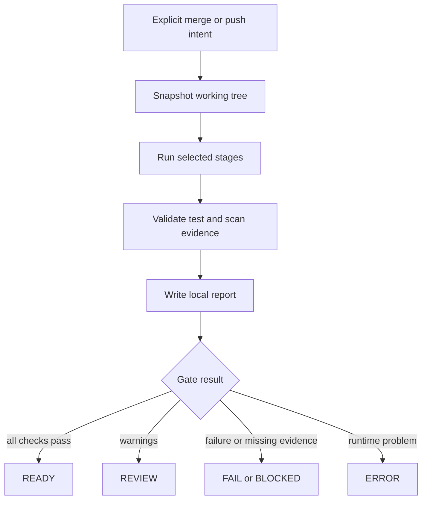

# Local CI Harness

> Local-first, policy-controlled CI for existing Git repositories.

[](LICENSE)
[](https://www.python.org/)
[](#requirements)

Run reproducible local checks before merging a branch or pushing an already-merged
`main`. No GitHub, Jenkins or hosted CI server is required. Jobs run in
short-lived, pinned containers; reports stay local. The harness never merges or
pushes for you.

Copyright 2026 codepawfect. Licensed under the [Apache License 2.0](LICENSE).

## 1. How a gate works

The harness snapshots the current working tree, including uncommitted changes,
then runs the stages selected in `.ci/harness.json`.



Typical stages are:

`install → secrets → static analysis → dependencies/IaC → lint/typecheck →
unit/integration tests → build → coverage → E2E → Sonar → evidence`

The order is profile-driven. E2E and Sonar are optional. A selected stage without
a safe command or verifiable evidence is `BLOCKED`, never silently skipped.

## 2. Requirements

- Python 3.10+
- Git
- Docker CLI with Compose v2 and internet access
- macOS: [Colima](https://github.com/abiosoft/colima) is used by default
- Linux: Docker Engine and Compose v2
- Windows: WSL2 with Docker Desktop WSL integration or Docker Engine in WSL2

Native Windows PowerShell and `cmd.exe` are not supported. Sonar-enabled
projects need at least 8 GiB available to Docker/Colima.

## 3. Setup

The normal path is:

```bash
git clone https://github.com/CodePawfect/local-ci-harness.git
cd local-ci-harness
./ci init
```

Connect a local project with the setup TUI:

```bash
./ci setup --repo /absolute/path/to/project
```

The setup TUI detects the repository, target branch, adapter, lockfiles, scripts
and evidence paths. It writes `.ci/harness.json` and does not modify application
manifests or tests. Select `sonar` if you want local Sonar analysis.

```text
/absolute/path/to/project/.ci/harness.json
```

`doctor` and `lock-images` are maintenance commands, not required for every
project.

## 4. Run a gate

Run the gate only when the next action is explicit.

### Feature branch ready to merge

```bash
./ci gate \
  --repo /absolute/path/to/project \
  --intent merge-to-main
```

The checkout must be on a non-`main` branch and the target branch must exist.

### Already merged locally, ready to push `main`

```bash
./ci gate \
  --repo /absolute/path/to/project \
  --intent push-main
```

The checkout must already be on the target branch. The harness checks the local
merged state but never performs the merge or push.

## 5. Reports and Sonar

Reports are namespaced by project and run:

```text
reports/<project-slug>/<run-id>/summary.json
reports/<project-slug>/<run-id>/summary.md
```

If `sonar` is selected, provision the local project once:

```bash
./ci up
./ci bootstrap --repo /absolute/path/to/project
```

To review Sonar results:

```bash
./ci up
./ci sonar credentials
# Open http://127.0.0.1:9000
./ci down
```

After each gate, SonarQube and PostgreSQL are stopped automatically. Results remain
in persistent volumes. Run `./ci up` to review them in the browser, then use
`./ci down` when finished.

## 6. Supported stacks

| Stack | Adapter |
|---|---|
| Next.js, React or TypeScript using npm | `next-npm` / `next-fullstack` |
| Spring Boot, single Maven module | `spring-maven` |
| Any repository with baseline checks | `generic` |
| Vite/React, Vue, Angular, Python, Go, Rust and other stacks | `custom` |

Adapters can run linting, typechecking, tests, coverage, builds, Playwright E2E
and Sonar when the profile provides the required commands and evidence. Plain
React/Vite uses `custom`. pnpm, Yarn, Gradle and multi-module Maven need
explicit custom configuration.

## 7. Monorepos and limits

V1 evaluates one application directory per profile:

```bash
./ci setup \
  --repo ~/repos/product \
  --subdir apps/web
```

It does not automatically aggregate multiple applications into one coverage or
Sonar result. Use separate profiles or an explicit, reviewed aggregate command.
Selected stages without a command or machine-readable evidence become
`BLOCKED`.

Project profiles cannot override central image pins, security policies, scanner
rules, thresholds or gates. Job containers do not receive the host Docker socket.
