# Local CI Harness

> Local-first, policy-controlled CI for existing Git repositories.

[](LICENSE)
[](https://www.python.org/)
[](#prerequisites)

Run a reproducible local gate before merging a branch or pushing an already-merged
`main`. No GitHub, Jenkins or hosted CI server is required. Jobs run in pinned,
short-lived containers; reports and evidence stay local.

Copyright 2026 codepawfect. Licensed under the [Apache License 2.0](LICENSE).

## 1. What happens in a normal gate?

The harness checks the exact current working tree, including uncommitted changes. It
then runs the stages selected in `.ci/harness.json`, validates machine-readable
evidence, and writes a namespaced report. It never merges, pushes or writes to `main`.

```mermaid
flowchart LR
    A["Explicit intent<br/>merge-to-main or push-main"] --> B["Snapshot Git tree<br/>branch, HEAD, merge-base, source hash"]
    B --> C["Install / resolve dependencies<br/>only when the profile needs it"]
    C --> D["Secrets<br/>Gitleaks"]
    D --> E["Static analysis<br/>Semgrep"]
    E --> F["Dependencies & IaC<br/>Trivy / CycloneDX"]
    F --> G["Lint + typecheck<br/>project commands"]
    G --> H["Unit tests<br/>JUnit evidence"]
    H --> I["Integration tests<br/>explicit command + evidence"]
    I --> J["Build<br/>production/build command"]
    J --> K["Coverage<br/>thresholds + LCOV"]
    K --> L["E2E<br/>Playwright, if selected"]
    L --> M["SonarQube<br/>analysis + Quality Gate, if selected"]
    M --> N["Evidence + source integrity<br/>current-run checks"]
    N --> O["READY / REVIEW / FAIL / BLOCKED"]

    classDef optional stroke-dasharray: 5 5;
    class I,L,M optional;
```



The order is profile-driven. Unselected stages are not silently treated as passed;
stages that are selected but lack a safe command or verifiable evidence become
`BLOCKED`.

| Stage | What it verifies | Typical implementation |
|---|---|---|
| `secrets` | Secrets in the working tree and, for full gates, Git history | Gitleaks |
| `static-analysis` | Central source-security rules | Semgrep |
| `dependencies` | Dependency vulnerabilities and IaC findings | Trivy; CycloneDX for Maven |
| `lint-typecheck` | Formatting/lint and type contracts | Project-defined argv commands |
| `tests` | Executed unit/integration test assertions | JUnit evidence is required |
| `integration` | Explicit service/API/database tests | Project-defined command + JUnit |
| `coverage` | Actual line/branch counters and Sonar LCOV input | Coverage report + thresholds |
| `build` | The configured production/build command | npm or Maven adapter |
| `e2e` | Browser flows and E2E evidence | Playwright |
| `sonar` | Exact analysis, issues and Quality Gate result | Local SonarQube |
| `zap` | Explicit local deployment baseline scan | Run `./ci zap` with acknowledgement |

### Gate results

| Result | Exit code | Meaning |
|---|---:|---|
| `READY` | 0 | Required stages passed without warnings. |
| `REVIEW` | 1 | The run passed but contains warnings to review. |
| `FAIL` / `BLOCKED` | 1 | A check failed or required evidence/configuration is missing. |
| `ERROR` | 2 | The runtime or harness could not produce a meaningful verification. |

## 2. Prerequisites

- Python 3.10+
- Git
- Docker CLI with Compose v2
- A supported Docker runtime with internet access for pinned images and dependencies

Runtime setup:

- **macOS:** Colima is used by default. Sonar JavaScript/TypeScript analysis needs
  at least 8 GiB exposed to the selected Colima profile.
- **Linux:** Docker Engine and Compose v2.
- **Windows:** run the harness inside WSL2 with Docker Desktop WSL integration or
  Docker Engine in WSL2. Native PowerShell and `cmd.exe` are not supported.

The normal project gate uses 4 GB per regular job container and 6 GB for the Sonar
scanner. The runtime preflight checks the 8 GiB Sonar requirement before starting
Sonar/PostgreSQL and does not resize the host runtime automatically.

## 3. First-time setup

Clone the harness once:

```bash
git clone https://github.com/CodePawfect/local-ci-harness.git
cd local-ci-harness
./ci init
```

Connect a local project with the setup TUI:

```bash
./ci setup --repo /absolute/path/to/project
```

The TUI detects the repository, branch, adapter, lockfiles, scripts and evidence
paths. Select the stages you want; for a normal quality gate, include `sonar`.
Setup writes these files into the target repository:

```text
/absolute/path/to/project/.ci/harness.json
/absolute/path/to/project/.ci/agent-prompt.md
```

It does not modify `package.json`, `pom.xml` or tests. `./ci prompt` is only needed
when you intentionally want to regenerate the agent prompt.

### First Sonar setup

If `sonar` is selected, provision the local Sonar project once:

```bash
./ci up
./ci bootstrap --repo /absolute/path/to/project
```

Bootstrap creates the project, assigns the local Quality Profile and Quality Gate,
creates scoped analysis tokens and provisions a read-only browser account. Secrets
remain under `.local/` with restrictive permissions; no browser password change is
required. Stop the services when finished with `./ci down`, or keep them running for
browser review.

The tracked `images.lock.json` already contains pinned core images. `doctor` and
`lock-images` are maintenance/troubleshooting commands, not required for every new
project or every gate.

## 4. Normal operation

Run the gate only when the next action is explicit.

### Feature branch ready to merge

```bash
./ci gate \
  --repo /absolute/path/to/project \
  --intent merge-to-main
```

The checkout must be on a non-`main` branch and the target branch must exist.

### Already merged locally, ready to push `main`

```bash
./ci gate \
  --repo /absolute/path/to/project \
  --intent push-main
```

The checkout must already be on the target branch. The harness checks the local
merged state but never performs the merge or push.

### Reports and Sonar UI

Every run is isolated by project and run ID:

```text
reports/<project-slug>/<run-id>/summary.json
reports/<project-slug>/<run-id>/summary.md
.local/projects/<project-slug>/runs/<run-id>/
```

Read only the current run's `summary.json` and `summary.md`. If you want to inspect
the Sonar results in a browser after a gate, start the persisted Sonar services and
print the read-only credentials:

```bash
./ci up
./ci sonar credentials
# Open http://127.0.0.1:9000
./ci down
```

The gate's job containers are removed after the run. Sonar/PostgreSQL containers and
their named volumes are managed separately; `down` removes containers but retains
the local Sonar data.

## 5. Agent workflow

The generated `.ci/agent-prompt.md` tells an agent to:

1. Run a gate only for an explicit merge or push intent.
2. Read the current run's summary and evidence.
3. Repair reproducible code failures and rerun the same gate.
4. Stop on secrets, infrastructure errors or unclear security findings.
5. Stop after three failed repairs for the same cause.
6. Never commit, merge, push or write to `main` automatically.

Agents must not weaken tests, coverage thresholds, scanner rules, exclusions,
timeouts or evidence requirements to make a gate pass.

## 6. Adapters and supported stacks

| Adapter | Best fit | Included behavior |
|---|---|---|
| `next-npm` | Next.js, React and TypeScript using npm | npm, lint, typecheck, tests, coverage, build, optional Playwright and Sonar |
| `next-fullstack` | Next.js with server/API/integration code | `next-npm` plus explicit integration commands |
| `spring-maven` | Spring Boot, Java, one Maven module | Surefire/Failsafe, JaCoCo, CycloneDX, Trivy and Sonar |
| `generic` | Any Git repository | Snapshot, Gitleaks, Semgrep and detectable dependency/IaC checks |
| `custom` | Vite/React, Vue, Angular, Svelte, Python, Go, Rust and other stacks | Safe argv arrays and explicit evidence paths |

Plain React/Vite currently uses `custom`; it has no dedicated adapter. pnpm, Yarn,
Gradle and multi-module Maven require explicit custom handling or future adapter work.
Shell strings are never evaluated; commands are stored as argument arrays.

## 7. Monorepos and other edge cases

### Monorepos

V1 evaluates one application directory inside the Git root:

```bash
./ci setup \
  --repo ~/repos/product \
  --subdir apps/web

./ci gate \
  --repo ~/repos/product \
  --intent merge-to-main
```

Commands and evidence paths are relative to `apps/web`. V1 does not aggregate
multiple applications into one coverage or Sonar result. Use separate profiles or
an explicit, reviewed aggregate command for `apps/web`, `apps/api` and similar
layouts.

### Missing commands or evidence

The harness never guesses a successful test, build or coverage result. A selected
stage without an executable command or machine-readable evidence is `BLOCKED`.

### Repository boundaries

External paths, external/dangling source symlinks and Git submodules are rejected by
the snapshot contract. Builds, package installation and tests execute project code;
only run trusted repositories.

### Security scope

Central policies, image digests, scanner rules, thresholds and gates cannot be
overridden by project profiles. Job containers do not receive the host Docker socket.
This is a local verification harness, not an OWASP certification product or a
complete adversarial-code sandbox.

## Documentation and contributing

- [Technical architecture](technical_doc.md)
- [Validation status and known limits](docs/VALIDATION.md)
- [Security test contract](docs/security-test-contract.md)
- [Research and source decisions](research.md)
- [Codex/agent template](templates/AGENTS.project.md)

Run the full harness test suite before submitting a change:

```bash
python3 -m unittest discover -s tests -v
```

The current suite contains 96 tests. Changes that weaken a gate, coverage threshold
or security policy require explicit documentation and review.
