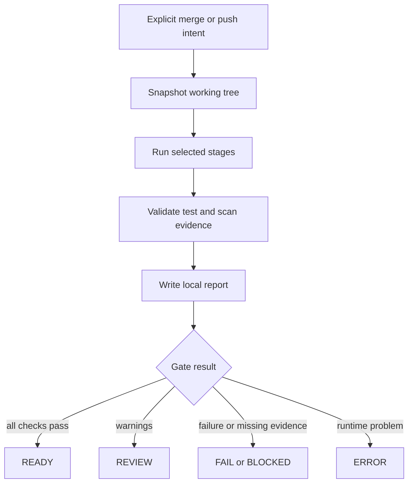

# Local CI Harness

> Local-first, policy-controlled CI for existing Git repositories.

[](LICENSE)
[](https://www.python.org/)
[](#requirements)

Run reproducible local checks before merging a branch or pushing an already-merged
`main`. No GitHub, Jenkins or hosted CI server is required. Jobs run in
short-lived, pinned containers; reports stay local. The harness never merges or
pushes for you.

Copyright 2026 codepawfect. Licensed under the [Apache License 2.0](LICENSE).

## 1. How a gate works

The harness snapshots the current working tree, including uncommitted changes,
then runs the stages selected in `.ci/harness.json`.


```mermaid
flowchart TD
    A[Explicit merge or push intent] --> B[Snapshot working tree]
    B --> C[Run selected stages]
    C --> D[Validate test and scan evidence]
    D --> E[Write local report]
    E --> F{Gate result}
    F -->|all checks pass| G[READY]
    F -->|warnings| H[REVIEW]
    F -->|failure or missing evidence| I[FAIL or BLOCKED]
    F -->|runtime problem| J[ERROR]
```

Typical stages are:

`install → secrets → static analysis → dependencies/IaC → lint/typecheck →
unit/integration tests → build → coverage → E2E → Sonar → evidence`

The profile selects checks, and the runner executes them in dependency order.
E2E and Sonar are optional. A selected stage without a safe command or verifiable
evidence is `BLOCKED`, never silently skipped.

Every merge/push gate must include `secrets`, `static-analysis`, `tests`, `coverage`
and `build`. Next.js also requires dependency scanning, linting and typechecking;
Maven requires dependency scanning. Other adapters require dependency scanning
when the application has a dependency manifest. These requirements and the
coverage floors (70% lines, 60% branches) live in `policy/quality.json`, outside
the application. Project thresholds may be higher, never lower. A baseline or
incomplete setup profile cannot produce `READY`; complete its commands, stages
and evidence first. Changes to central requirements require owner review.

JUnit reports with partially skipped tests produce `WARN` and a `REVIEW` gate;
zero executed tests fail. Before each test/coverage producer, old report files
are removed from the disposable snapshot, including custom evidence paths.
The original repository is untouched. Validated reports are archived per stage
with their producer, run ID and SHA-256, so a later stage sharing an output
directory cannot replace an earlier stage's proof.

## 2. Requirements

- Python 3.10+
- Git
- Docker CLI with Compose v2 and internet access
- macOS: [Colima](https://github.com/abiosoft/colima) is used by default
- Linux: Docker Engine and Compose v2
- Windows: WSL2 with Docker Desktop WSL integration or Docker Engine in WSL2

Native Windows PowerShell and `cmd.exe` are not supported. Sonar-enabled
projects need at least 8 GiB available to Docker/Colima.

## 3. Setup

Run these commands from the cloned `local-ci-harness` directory. Run
`./ci init` once per clone. On macOS, the harness starts the default Colima
profile when needed.

The normal path is:

```bash
git clone https://github.com/CodePawfect/local-ci-harness.git
cd local-ci-harness
./ci init
```

Connect a local project with the setup TUI:

```bash
./ci setup --repo /absolute/path/to/project
```

The setup TUI detects the repository, target branch, adapter, lockfiles, scripts
and evidence paths. It writes `.ci/harness.json` and does not modify application
manifests or tests. Select `sonar` if you want local Sonar analysis.

```text
/absolute/path/to/project/.ci/harness.json
```

`doctor` and `lock-images` are maintenance commands, not required for every
project.

## 4. Run a gate

Run the gate only when the next action is explicit.

### Feature branch ready to merge

```bash
./ci gate \
  --repo /absolute/path/to/project \
  --intent merge-to-main
```

The checkout must be on a non-`main` branch and the target branch must exist.

### Already merged locally, ready to push `main`

```bash
./ci gate \
  --repo /absolute/path/to/project \
  --intent push-main
```

The checkout must already be on the target branch. The harness checks the local
merged state but never performs the merge or push.

## 5. Reports and Sonar

Reports are written inside the `local-ci-harness` directory under
`reports/<project-slug>/<run-id>/`:

```text
reports/<project-slug>/<run-id>/summary.json
reports/<project-slug>/<run-id>/summary.md
```

If `sonar` is selected, provision the local project once:

```bash
./ci up
./ci bootstrap --repo /absolute/path/to/project
```

To review Sonar results:

```bash
./ci up
./ci sonar credentials
# Open http://127.0.0.1:9000
./ci down
```

After each gate, SonarQube and PostgreSQL are stopped automatically. Results remain
in persistent volumes. Run `./ci up` to review them in the browser, then use
`./ci down` when finished.

## 6. Supported stacks

| Stack | Adapter |
|---|---|
| Next.js with npm | `next-npm` / `next-fullstack` |
| Spring Boot, single Maven module | `spring-maven` |
| Any repository with baseline checks | `generic` |
| Vite/React, Vue, Angular, Python, Go, Rust and other stacks | `custom` |

Adapters can run linting, typechecking, tests, coverage, builds, Playwright E2E
and Sonar when the profile provides the required commands and evidence. Plain
React/Vite uses `custom`. For custom projects, edit `.ci/harness.json`
with safe argument-array commands and evidence paths; missing required evidence
results in `BLOCKED`. pnpm, Yarn, Gradle and multi-module Maven need
explicit custom configuration.

## 7. Monorepos and limits

V1 evaluates one application directory per profile:

```bash
./ci setup \
  --repo ~/repos/product \
  --subdir apps/web
```

It does not automatically aggregate multiple applications into one coverage or
Sonar result. Use separate profiles or an explicit, reviewed aggregate command.
Selected stages without a command or machine-readable evidence become
`BLOCKED`.

Project profiles cannot override central image pins, security policies, scanner
rules, thresholds or gates. Job containers do not receive the host Docker socket.

## 8. Reproducibility and harness verification

Jobs explicitly use the OS/architecture recorded with each locked image. The
source hash includes file paths, contents, symlink targets and executable bits;
reports identify the hash format as `tree-sha256-v2`. A change to source HEAD,
the current branch or the target commit during a gate invalidates the result.

Jobs use `TZ=UTC`, `LANG=C.UTF-8`, `LC_ALL=C.UTF-8` and `PYTHONHASHSEED=0`.
Profiles cannot override these values. Application tests must still control
their own clocks and random-number generators; Python's hash seed does not seed
application randomness. npm installations must use `npm ci`.

Writable npm, Maven, Sonar and Trivy caches are isolated by run. Reports record
dependency-manifest checksums and the cache checksums before and after each job,
alongside image digests, platforms and network modes. This makes changes in
external inputs visible and prevents cross-project cache writes. Cold caches
require downloads and may increase runtime and disk usage. This is **not a
hermetic replay guarantee**: registries, scanner databases, network services and
live Sonar policy can still change between runs. `merge-to-main` checks the
feature working tree and records the target commit; it does not yet build a
synthetic merged tree.

Run the host regression suite after every harness change:

```bash
python3 -m unittest discover -s tests -v
```

Run the explicit Docker integration suite separately:

```bash
python3 tests/verify_integration.py
```

It uses the existing image lock and central scanner policy, without installing
tools or mocking container jobs. The custom Node fixture runs real Node tests
and native coverage. It checks a passing gate, an unchanged repeat, rejected
stale JUnit evidence, a visible partial skip, a caught code mutation and an
incomplete profile. Infrastructure failures fail the suite; they are never
skipped. Evidence is retained in `.local/integration/<session>/verification.json`
and the corresponding `reports/<project>/<run>/` directories. These cases do
not verify Next.js, Maven, browser E2E or Sonar integration. The original delivery
has not been Docker-integration-tested; new evidence is limited to the specific
cases actually executed.
